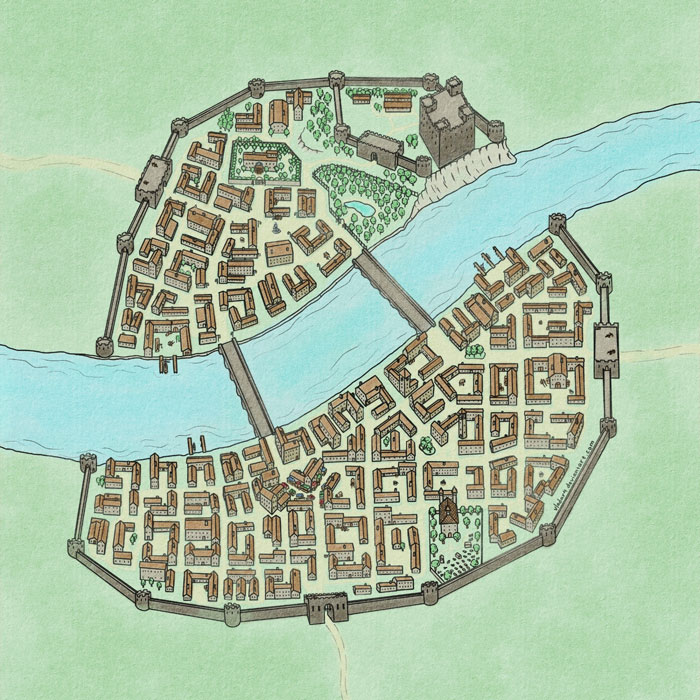
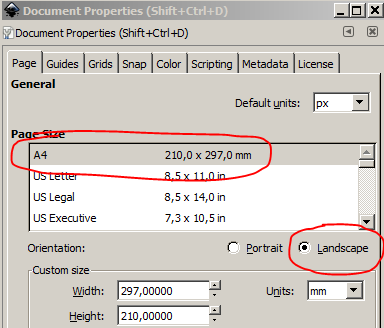
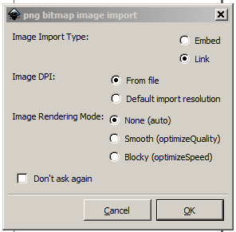
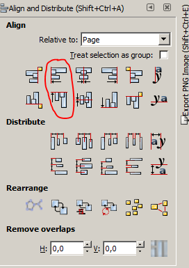
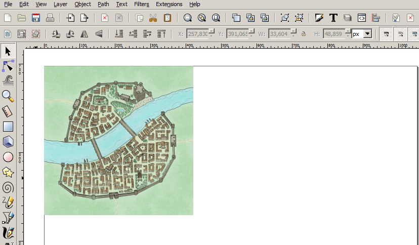
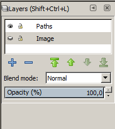
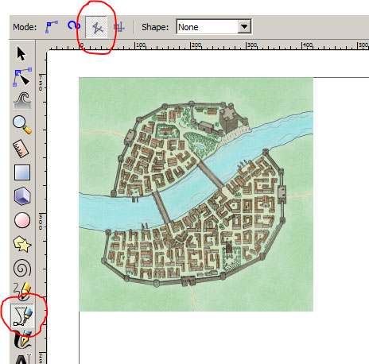
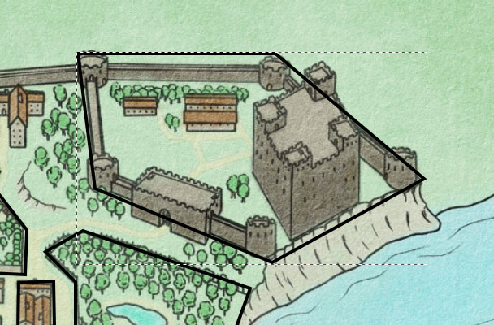
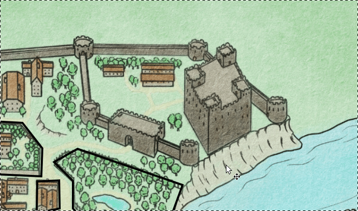
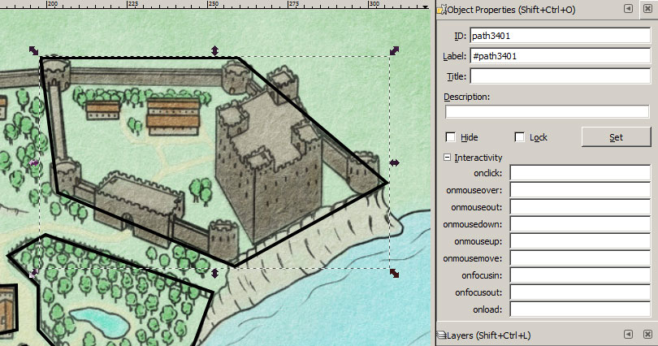

# Создаем карту полигонов с нуля
 
Этот способ подойдет в тех случаях, когда изображение карты подготовлено в графическом редакторе или сторонней программе типа Hexographer, Dungeon Painter или CC.

Для примера я взял карту небольшого средневекового городка (автор Vladar)

Поехали!

Запускаем Inkscape.

Устанавливаем базовые свойства документа: меню File-> Document Properties (Shift-Ctrl-D), выбираем A4/Landscape.

Теперь вставляем на лист карту из файла:  меню File -> Import (Ctrl-I). Выбираем изображение  и в диалоге импорта выбираем указанные значения:

После импорта изображения выравниваем его по границе листа. Выделяем изображение, меню Object -> Align and Distribute (Shift-Control-A), выбираем:

Можно выровнять изображение и по центральным линиям листа – разницы нет, просто запомните, как вы это сделали для конкретной карты. В будущем, если вы захотите исправить файл карты и привязать к нему уже имеющийся файл разметки - нужно будет проставить строго такие же параметры выравнивания изображения на листе (align & distribute).

Получилось вот что:

В данном случае карта почему-то меньше размера листа (а может получиться так, что она будет намного больше), но растягивать карту на весь лист не надо - это изображение и при масштабировании неизбежно потеряются детали или найдутся артефакты масштабирования. Размер карты и границы зума задаются во время импорта на сайт.

Теперь открываем палитру слоёв: Layer -> Layers (Shift-Ctrl-L) и текущий слой переименовываем в ‘Image’.
Потом нажимаем на плюсик и создаем еще один слой с именем ‘Paths’. Все полигоны рисовать будем именно на новом слое. Выбираем слой мышкой:

С подготовительными шагами закончили, теперь переходим к разметке регионов:

Выбираем инструмент «Кривые Безье» (Shift-F6) и обязательно выбираем режим ломаных линий (create a sequence of straight line segments). Забудьте именно о кривых Безье, движок визуализации их рисовать не умеет. С этим придётся смириться. Возможно, когда-нибудь я напишу преобразование кривых Безье в ломаные линии или добавлю возможность рисовать произвольные регионы прямо на сайте.

Как рисовать полигон? Вообще-то это интуитивно понятно. 
1. полигон должен быть замкнутым (иначе какой это полигон?). 
2. Во-вторых, Inkscape даёт подсказку – когда мы хотим замкнуть линию – мы подводим курсор к стартовому узлу. Если он зажигается красным – при клике на нём мы получим замкнутый полигон. Вот что получилось:

Давайте посмотрим на видео:

Выбрав тот или иной регион, мы можем задать его свойства – Object -> Object properties (или Shift-Ctrl-O)

- **Идентификатор региона (ID)** менять можно, но осторожно. Я категорически рекомендую использовать только латинские буквы, цифры и всякие знаки подчеркивания/дефисы. Категорически недопустимы пробелы, я не рекомендую использовать русские буквы и символы `#&*+@~!`
- В поле **Label** можно указать кодовое имя региона (условия те же, что и в ID).
- В поле **Title** можно указать описание региона - то, что будет использовано для заголовка инфобокса если информация для региона не указана. [@TODO@]

Для корректной обработки заданных в полях ‘Label’, ‘Title’ или ‘Description’ значений нужно будет во время импорта указать галочки в соответствующих пунктах. Поле 'Label' задает alias региона, 'Title' задает его название, 'Description' – содержание. Следует помнить, что наличие информации хотя бы в одном из полей Title или Description означает, что по региону есть информация. Но, конечно, мы можем пропустить заполнение этих значений во время разметки полигонов и задать эти значения уже через интерфейс карты на сайте.

[@TODO@: Импорт, чекбокс: «предположить наличие информации о регионах на основе атрибутов title и description»]

Помните, что во время разметки карты на полигоны мы должны находиться на слое ‘Paths’. Если какой-то регион мы нарисовали на слое ‘Image’ – его можно переместить туда вручную.

